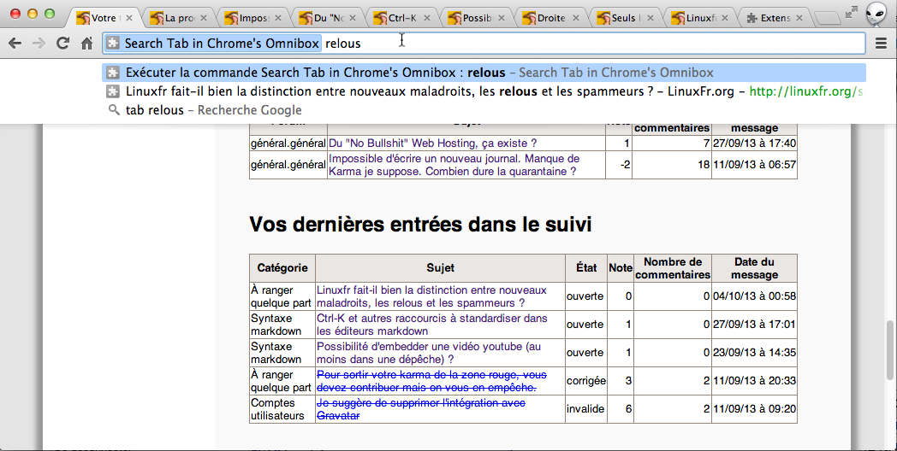
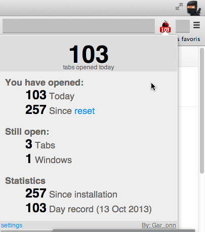

1. il faudra rajouter que si l'extension en question est pour Chrome, si quelqu'un souhaite repomper l'idée pour Firefox voire pour un autre navigateur, il est entièrement bienvenu
2. il reste un paragraphe en anglais à traduire
3. ça serait bien de rajouter une capture d'écran dans le Webstore (c'est quand même très moche sans ça). Oui mais... ça a l'air bête, je ne sais pas comment satisfaire cette règle-ci : [In the Screenshots section, upload at least one screenshot of the app (1280x800 or 640x400). Four or five would be better.](https://developers.google.com/chrome/web-store/docs/get_started_simple?hl=fr#step7). Une bonne âme pourrait-elle prendre une capture d'écran en 1280x800 ?
4. je pense qu'il y a encore des bugs dans le formulaire que j'ai fait hier soir, quelqu'un pour confirmer ?

  PROJET LIBRE : SEARCH TAB IN CHROME'S OMNIBOX
  
Chers linuxfriens, je viens de mettre à disposition des utilisateurs des navigateurs basés sur *Blink* - en pratique c'est seulement testé sur Google Chrome - une version légèrement améliorée d'un petit projet libre qui allait tomber dans l'oubli et auquel j'ai apporté des améliorations minimales.
  
  
## Scenario : les onglets c'est très bien sauf que là j'en ai ouvert trop pour mon cerveau. À l'aide. 

Vous entamez une session de sur sur internet dans votre navigateur. Sans vous en rendre compte, vous arrivez rapidement à 15 onglets et plus. Il arrive alors parfois que vous deviez retourner sur l'onglet qui n'est pas juste à côté de celui sur lequel vous êtes, en tous cas vous le perdez, vous parcourez les onglets un par un, ça vous fait perdre un peu de temps et ça vous énerve un peu. Un peu à chaque fois, mais en fait ceci se passe très souvent non ? En tout cas pour moi oui, d'où ce projet.

## SolutionS sophistiquées

Alors en réalité, il existe plein de solutions sophistiquées à ce problème, beaucoup mieux que celle de cette extension. 

Rien que pour Google Chrome, vous pourrez trouver dans le Webstore des extensions qui font des choses plus admirables les unes que les autres : *Too Many Tabs, Tabs Outliner, Bookmark My Tabs, One Tab, TabMan Tabs Manger, Tab Manager, Project Tab Manger, 10+Tabs MASTER →Fast Speed Scroll w/LATER Tab, Resolver Tabs, Tab out, TabJump, TabCaroussel, IE Tab Multi*

Ensuite, il y a fort à parier que si vous changez de navigateur vous trouverez encore plus de créativité pour résoudre brillament ce problème

## Solution minimaliste apportée par cette extension
 
 Cette extension ci ne fait qu'une chose (et le fait-elle bien ? pas sûr). En tout cas ce qu'elle fait c'est de vous permettre depuis l'Omnibox (la barre d'adresse + moteur de recherche de chrome) de rechercher grâce au mot-clé **tab** (c'est à dire *onglet* en français. peu original non ?) parmi les titres des onglets qui sont ouverts.
 
 Une image valant mieux qu'un long discours :
 
 
 
 Rapidement : je tabe dans l'omnibox de Chrome `tab<tab>relous<Entrée>` et hop, je tombe sur l'onglet désiré.
 
 En décomposant :
 - **tab** est à taper tel quel. C'est le mot clé qui permet d'appeler l'extension
 - **<tab>** c'est en revanche une seule touche, la touche *tabulation*, celle située au-dessus de l'horrible CAPS LOCK (VERR. MAJUSCULES). 
 - **relous** : ça c'est votre recherche, qui peut contenir plusieurs mots séparés par des espaces. L'idée étant que si un onglet contient le motif de votre recherche, vous aller pouvoir y accéder facilement.
 - **<Entrée>** : ça c'est à nouveau une touche, la grosse touche biscornue au milieu droite du clavier. Vous pouvez aussi utiliser les flèches de navigation pour sélectionner les deuxièmes, troisièmes, ... résultats. Mais si ce que vous recherchez est en premier, contentez-vous de taper sur `Entrée`
 
 
## Bof. Et ça marche jusqu'à combien d'onglets ce truc ? J'ai 70 onglets d'ouvert là.
 
Alors il est *possible* que ça marche pour 70 onglets, mais je n'ai pas testé et je ne vais pas le faire non plus... 

En effet, mon opinion, et je la partage, c'est que un internaute devrait avoir maximum 15 onglets ouverts en même temps. Et encore 15, c'est pour les  moments où il fait un truc particulier (ex: rajouter une catégorie dans 10 articles de Wikipedia en parallèle). Pour moi au-delà de 15 ce n'est plus gérable.

Effectivement direz vous, cette bouse de Chrome/Firefox/... n'arrive pas à bien gérer mes 70 onglets ? Non pour moi, ce n'est que très secondairement un problème technique, c'est avant tout une limitation du cerveau humain. En tout cas du mien, le vôtre est peut-être différent. 

Je fais pas mal de choses sur le web et depuis que j'ai compris que mon cerveau gripait au-delà de 15, j'applique avec un certain bonheur une stratégie qui me permet de faire tout ce que je veux avec 15 onglets maximum (et en fait nettement moins la plupart du temps).

*Suggestion* : commencez par installer [l'extension TabCounter pour Chrome](https://chrome.google.com/webstore/detail/tabcounter/kibiopnambcddkfkkefcopfpbljphchi) si ce sujet vous titille. Vous aurez ainsi des statistiques rigolotes sur votre utilisation de cette fonctionnalité puissante donc dangereuse qu'est la navigation par onglet.

## Misc

(extrait de README.md et non traduit, désolé)

- "author": "aboodman, jmfayard", 
  -  aboodman original author of "Switch to Tab"
  - jmfayard wanted to use the "tab" keyword, had to fork it for various reasons, then to port it to manifest_version : 2
- Releaser under a Free as in Freedom License (see LICENCE)
- Get the source luke
> git clone https://github.com/internaciulo/search-tab-in-chrome-s-omnibox`
- Wanna contribute ? Awesome.
  - If you want contribute source code and already know Chrome programming just go ahead
  - If you don't know Chrome programming, no problem, I didn't either. it's not hard and it's fun. Take a look at "manifest-with-comments.json" first
  - You can translate and i18n too. Look in `TRANSLATORS` then `_locales/en/messages.json`
  - You can help to make it pretty too. I can't help with that, sorry :)

## Si jamais l'extension vous plaisait

Les chèques avec de nombreux zéros avant la virgule sont acceptés.

Alternativement, ça serait très sympa de prendre quelques minutes pour remplir le formulaire ci-dessous qui me permettrait de finir un article. En gros j'ai l'intuition que l'email est un outil difficile à utiliser... y compris pour les gens qui connaissent trop bien la technologie... mais qu'en même temps il y a des solutions de bon sens à ça.

Le formulaire en question : [Les technophiles au piège de l'email ?](https://docs.google.com/forms/d/1ubGd-3XgBcH91FsDVe6KKDreEUkDMK7xXpldpMkosaU/viewform)
